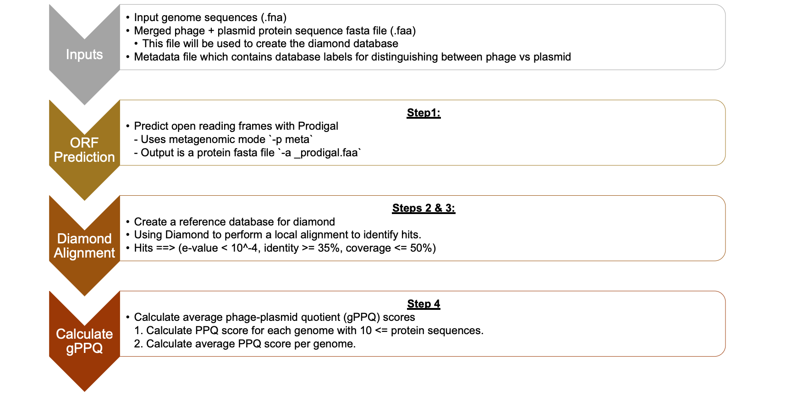

# gPPQ Calculator

gPPQ_calculator.py is a python script for calculating the [PPQ and gPPQ scores from Pfeifer et.al. 2021](https://academic.oup.com/nar/article/49/5/2655/6137301).

The pipeline can be summarized with 4 steps: 

1. Predict open reading frames with Prodigal
2. Create a reference database for diamond
3. Perform local alignments using Diamond to generate hits to Phages and or Plasmids
    - **Hits:**
        - e-value < 10^-4
        - identity >= 35%
        - coverage <= 50%
4. Calculate average phage-plasmid quotient (gPPQ) scores
    1. Calculate PPQ score for each genome with 10 <= protein sequences
        - How are the scores are calculated?
          - Phage Hits normalized by the length of the Phage database --> H(Phage) 
          - Plasmid Hits normalized by the length of the Plasmid database --> H(Plasmid)
          - Take normalized phage hits divide by the sum of normalized phage hits and normalized plasmid hits
    2. Calculate average PPQ score per genome.

**Phage-plasmid quotient (PPQ):**

**gPPQ:**

 %2B \sum Plasmid \, PPQs}">

## Getting Started

### Prerequisites

Make sure to have the following dependencies installed:
- [Prodigal](https://github.com/hyattpd/Prodigal) (v2.6.3)
- [DIAMOND](https://github.com/bbuchfink/diamond) (v0.9.14)
- [Pandas](https://pandas.pydata.org) (v1.2.4)
- [Biopython](https://github.com/biopython/biopython) (v1.78)

## Usage

    usage: gPPQ_calculator.py [-h] --fna FNA --db DB [--min_hits MIN_HITS] [--max_identity MAX_IDENTITY] [--extract_seqs] [--threads THREADS] --out OUT

    optional arguments:
      -h, --help            show this help message and exit
      --fna FNA             Input fasta file or path to the file
      --db DB               Path to database directory containing: proteins.dmnd, proteins.faa, proteins.tsv
      --min_hits MIN_HITS   Minimum number of hits to calculate PPQ
      --max_identity MAX_IDENTITY
                            Exclude hits with identity exceeding this value
      --extract_seqs        extracts predicted phage-plasmid (p-p) sequences from input file, default = False
      --threads THREADS     Number of CPU threads; used for diamond
      --out OUT             Output directory

 
Example:

    python gPPQ_calculator.py --fna input_sequences.fna --db merged_plasmid_virus_db.faa --meta_db mergedDB_metadata.csv --threads 4

## TODO
- Next steps:

    - [ ] Move to using [Pyrodigal](https://github.com/althonos/pyrodigal) instead of base Prodigal.

## Contact

